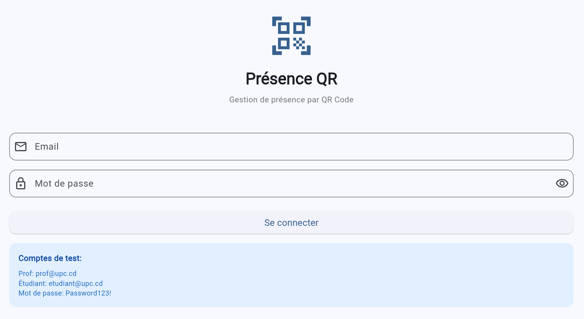

# Attendance QR App - Gestion de Présence UPC

App Flutter pour gérer les présences via QR Code.

## Le projet avance

L'app tourne deja, voici l'ecran de connexion fonctionnel :



L'authentification Firebase est en place, les ecrans de base sont la, le backend est operationnel. On est sur la bonne voie les gars, on continue comme ca.

---

## Installation Rapide

### Prérequis
- Flutter SDK installé
- Android Studio ou VS Code
- Compte Firebase

### Setup du Projet

```powershell
cd attendance_qr_app
flutter pub get

# Configurer Firebase
dart pub global activate flutterfire_cli
flutterfire configure

flutter run
```

## Configuration Firebase

### Setup rapide
1. Générer firebase_options.dart avec flutterfire configure
2. Activer Email/Password dans Firebase Console
3. Créer 2 utilisateurs test (prof@upc.cd, etudiant@upc.cd)
4. Déployer les règles Firestore : firebase deploy --only firestore:rules

## Structure du Projet

```
lib/
├── main.dart              # Point d'entrée
├── models/                # Modèles (User, Schedule, Attendance)
├── services/              # Backend (Auth, Firestore)
├── providers/             # State management
└── screens/               # Interfaces UI
```

## Fonctionnalités

Professeurs:
- Créer des séances
- Générer QR codes
- Voir présences en temps réel

Étudiants:
- Scanner QR codes
- Marquer présence
- Voir historique

## Commandes Utiles

```powershell
flutter pub get          # Installer dépendances
flutter analyze          # Analyser le code
flutter clean            # Nettoyer le build
flutter run              # Lancer l'app
flutter build apk        # Build APK
```

## Documentation

- PROGRESSION.md - Etat d'avancement du projet

## Problèmes Courants

Erreur: "No Firebase App"
- Exécuter flutterfire configure

Erreur: "Permission denied" (Firestore)
- Déployer les règles: firebase deploy --only firestore:rules

Dossiers en rouge dans l'IDE
- Configurer le SDK Dart (voir ci-dessous)

## Configuration IDE (IntelliJ/Android Studio)

1. File → Settings → Languages & Frameworks → Dart
2. Cocher "Enable Dart support"
3. Dart SDK path: C:\Users\KEVIN\flutter_windows_3.35.6-stable\flutter\bin\cache\dart-sdk
4. Apply → OK

## Équipe

Lead Technique: Kevin
- Architecture Firebase
- Services backend

## Support

Firebase Console: https://console.firebase.google.com  
Projet: attendance-qr-upc


